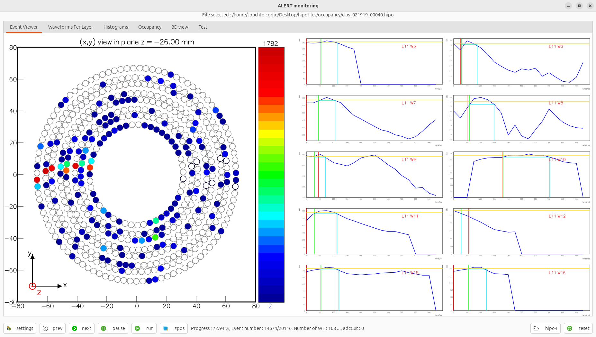
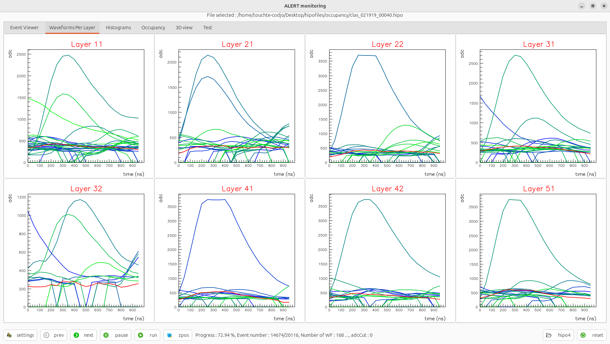
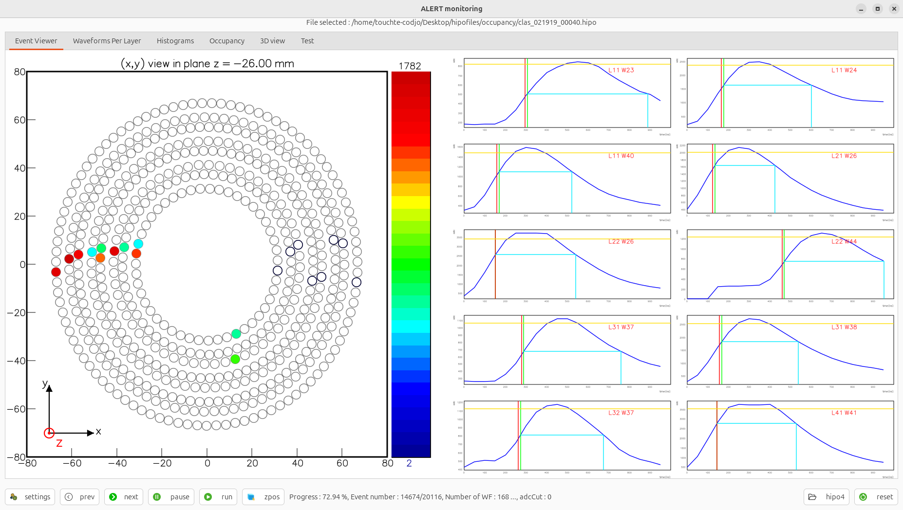
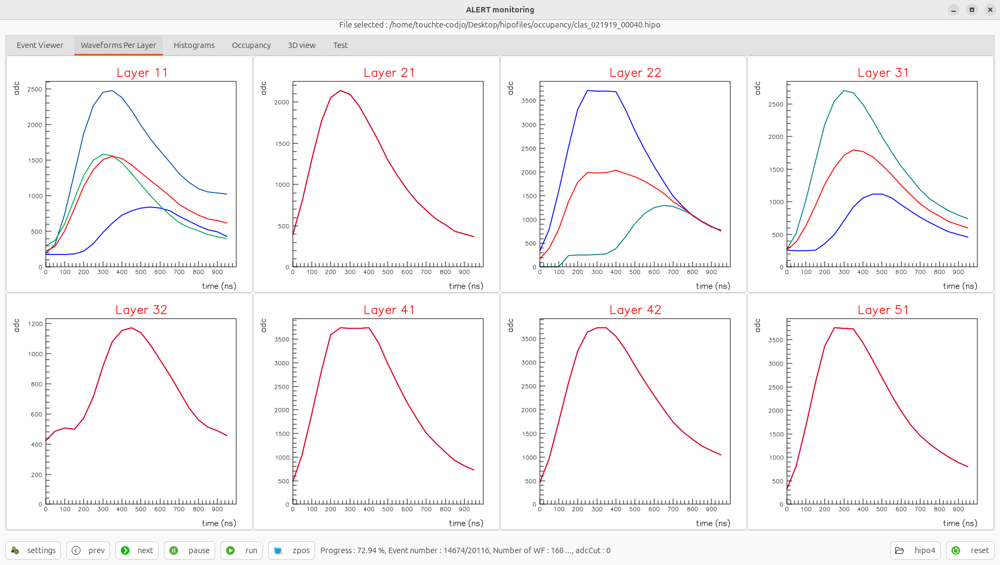
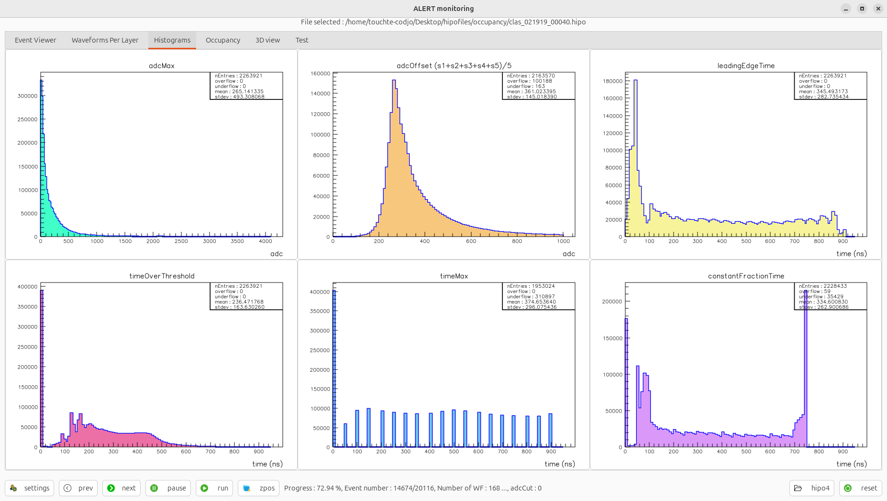
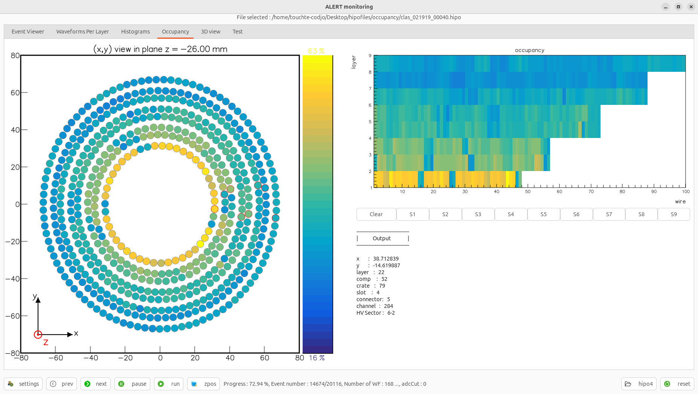
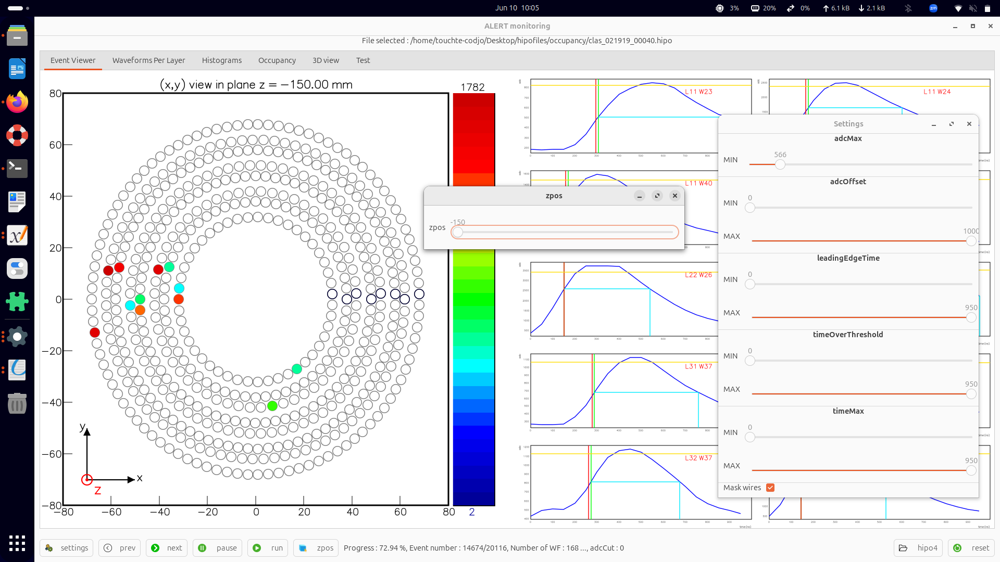
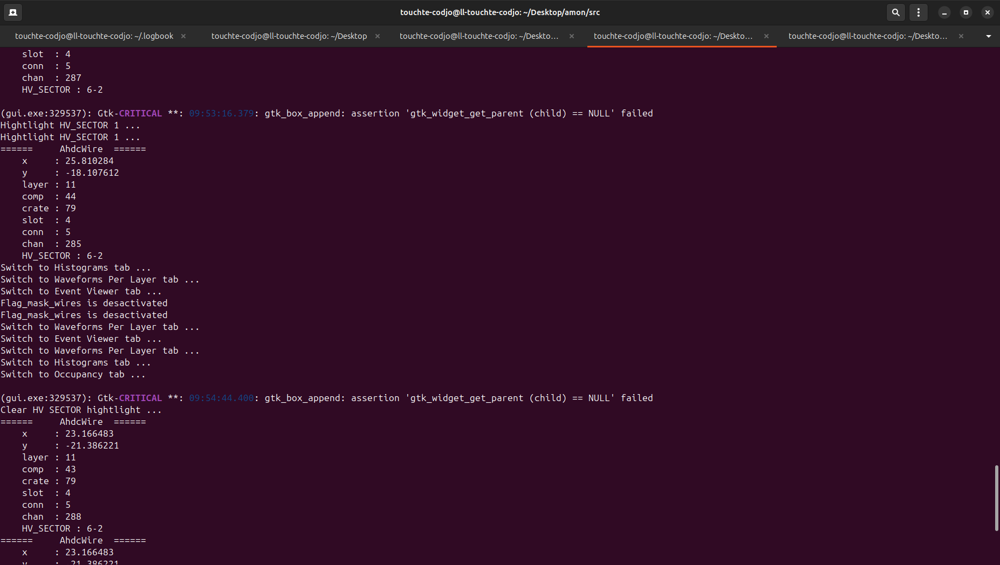

# Dependencies

The code has been designed on Ubuntu-24.04

I'm still working on making this code more portable. For now, one has to do the installation by *hand*.

```shell
gtkmm-4.0
cairomm-1.16
```

**This portion of code in the `src/Makefile` must be replaced to match your current installation of the HIPO utility for C++**

```
PATH2HIPO := /usr/local

HIPOCFLAGS  := -I$(PATH2HIPO)/hipo4 -I$(PATH2HIPO)/hipo4/chart   
HIPOLIBS    := -L$(PATH2HIPO)/hipo4/lib -lhipo4 
```


# Run

```shell
cd src/
make
./gui.exe
```

# Usage

1. Select a HIPO file
1. Navigate through the events the buttons
1. Pause and Reset before loading a new file
1. In settings, you can make some cuts
1. Use zpos button to rotate the detector

# Event with no cuts

# All signals per layer

# Event with adc cut

# Signals with adc cuts

# Histograms

# Occupancy

# Control parameters

# Terminal


```

